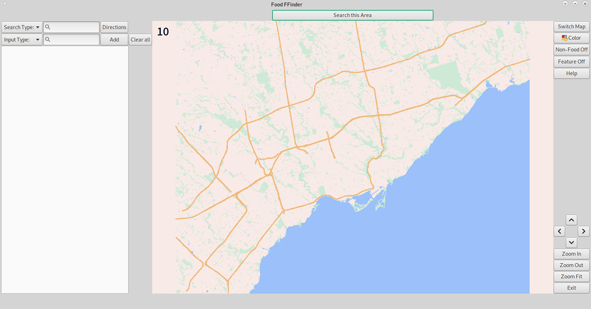

# Food FFinder
A map application written in C++ using an API to query lower level OpenStreetMap data and the libcurl library to access restaurant data in Google's Places API.

> Note that the source code is not public since this is a school project.

## Features
 * Streets displayed with multiple levels of distinction (motorway/trunk, primary, secondary, tertiary/unclassified/residential, links)
 * Dynamic street names (one name per street)
 * Pulsing location indicators upon clicking intersection/point of interest
 * Search autocomplete for streets, points of interest (restaurants), and intersections
 * Information toggles to display or hide map features and non-restaurant locations
 * Clear navigation directions to indicated destinations
 * "Search this Area" that loads points of interest in current screen view area
 * Dynamic loading of streets, street names, and points of interest based on zoom level
 * Dark mode

## Technical Features
 * Read data from Open Street Map database
 * Use the libcurl library to access restaurant data from Google's Places API
 * Graphical interface built using GTK   
 * Dijkstra's algorithm with A* heuristics
 * Travelling salesman problem (with added constraints) using a nearest neighbour algorithm and iterative optimization algorithms   
 * Runtime optimization by precomputing map information and using multi-threading

## Images

 
 

